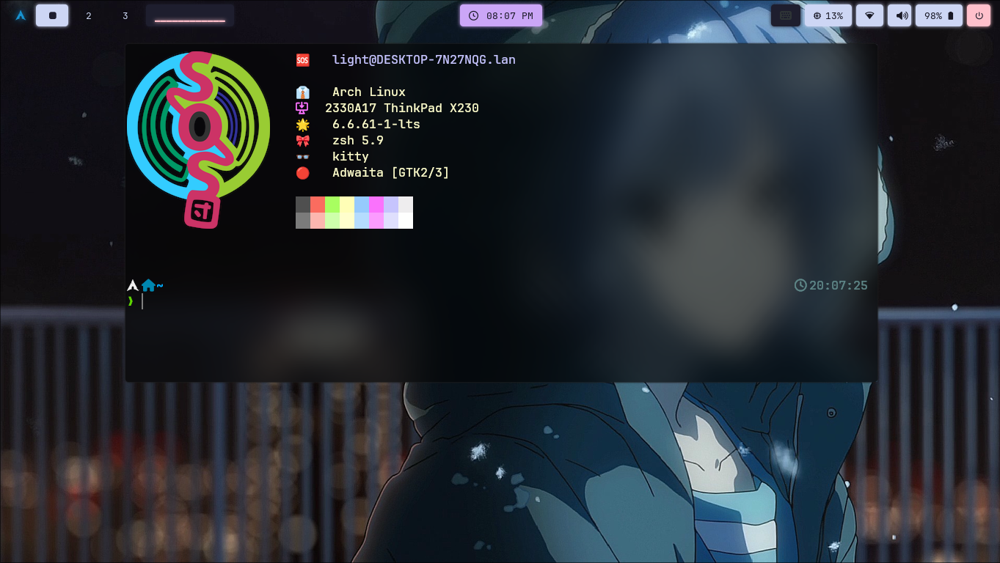

# dotfiles

A collection of configuration files and scripts to automate the setup of [Hyprland](https://hypr.land/)(mainly) and additional utilities for a freshly installed **Arch Linux** system.

It also covers config for [i3wm](https://i3wm.org/), as a side note, to bring back the good old memories I had with i3.

## Start

To start, I assume you have a minimal Arch Linux System installed, and ensure that your user account has **`sudo` privilege** enabled, since it's required by the autosetup script.

Now switch to your user account with sudo previlege.

Under your home directory,

### Clone this Repository

```bash
git clone https://github.com/lightmon233/dotfiles.git
```

and cd into it:

```bash
cd dotfiles
```

### Make the scripts runnable

```bash
find . -name "*.sh" -exec chmod +x {} +
```

### Run `autosetup.sh` as prompted

```bash
./autosetup.sh
```

> [!NOTE]
> Do not use sudo to run this script, you will be prompted to give the sudo privilege while the script is running.

## preview



## To-DO List

- [ ] Fix `autosetup.sh` double asking passwd issue.
- [ ] Restore & Repair i3wm configs.
